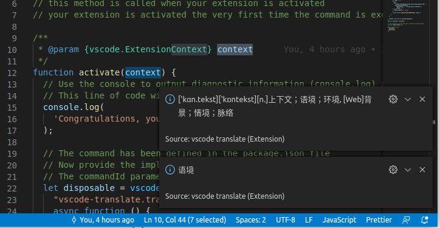

# 翻译小插件

一个 vscode 编辑器的翻译小插件，满足自用需求。

- 选择文本后，使用快捷键 `ctr+shif+t` 进行翻译
- 翻译结果来源`google`翻译
- 如果是单个的英文单词，还会返回`bing`词典的翻译



## 翻译系列自产自消项目

- 后端翻译服务（smart-translator）： https://github.com/fishjar/smart-translator
- 谷歌浏览器翻译插件（mihuan-translate）： https://github.com/fishjar/mihuan-translate
- VSCODE 翻译插件（vscode-translate）： https://github.com/fishjar/vscode-translate

## 打包

```sh
vsce package
```
